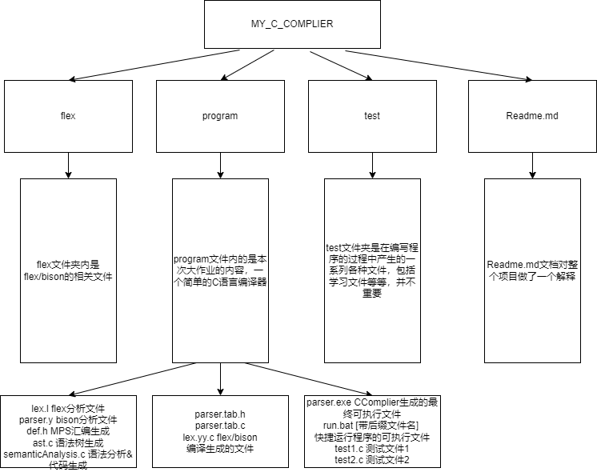
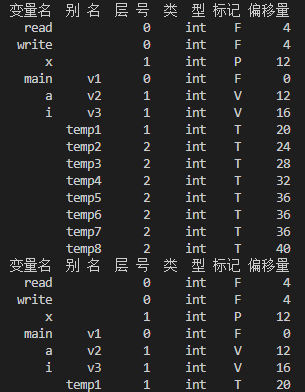
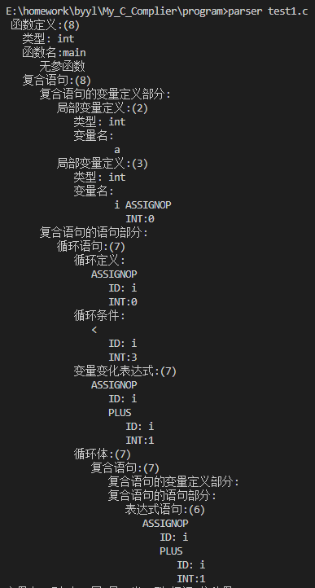
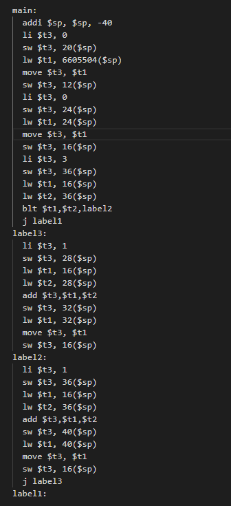
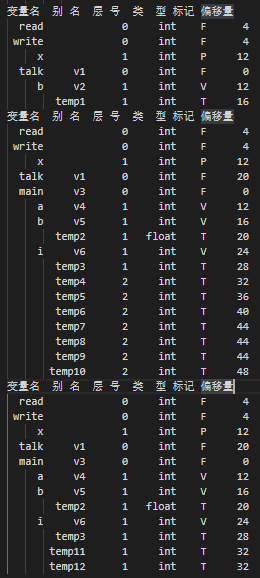

## 简单的C语言编译器

#### 项目结构：




本项目完成了一个基本的C语言编译器，目前阶段主要完成了以下功能：

**功能实现：**

* [X] 词法分析
* [X] 语法分析&构建语法树
  * [X] 支持函数调用
* [X] 类型检查
* [X] 中间代码生成
* [X] 目标代码生成
  * [X] 生成MIPS汇编指令
  * [X] 目标代码可使用MARS运行


#### 运行方式

* 首先配置系统的环境变量，将flex文件夹下的bin目录的绝对路径添加进系统Path的环境变量，确保flex和bison指令可以正常执行
* 进入program文件夹内打开终端，或者使用vscode直接将program添加进工作区，在终端内输入 `run [带后缀的文件名]`,此时将会自动对[带后缀的文件名]的文件进行分析(.c后缀)

**一个例子**

`run test1.c`

注意：全程使用GBK编码方式！

#### 项目分工

* 王雨航202083250002：语法分析&构建语法树，目标代码生成
* 陆欣驰202083260194：词法分析，readme文档书写
* 吕正202083260078：类型检查，readme文档书写
* 孙世昂202083290054：中间代码生成，readme文档书写


#### 项目内容

* 编写文件：

`lex.l`文件: 词法分析部分

`parser.y`文件: 语法分析部分

`def.h`文件: 中间代码生成，编写语法树结点类型、三地址结点类型等定义,以及三地址TAC代码结点,采用单链表存放中间语言代码

`ast.c`文件: 编写语法分析，递归产生语法树的先序遍历

`semanticAnalysis.c`文件 主要函数:

> ①fillSymbolTable fuction 变量定义处理
>
> ②ext_var_list function 变量列表处理
>
> ③boolExp & Exp function用于处理基本表达式的语法检查
>
> ④semantic_Analysis function用于语义检查和中间代码TAC语句生成
>
> ...

* 经flex/bison等编译生成的文件

`parser.tab.c`

`parser.tab.h`

`run.bat` 自己编写的脚本，用于运行程序，其运行格式为 `run [filename.c]`

* 结果文件

`parser.exe ` 编译器项目最终可执行文件

`object.s` 生成的MIPS格式汇编指令


#### 运行结果

* 首先对于题目文档中给出的程序

```cpp
void main() {
 int a;
 for (int i = 0; i < 3; ) {
 i = i + 1
 }
}
```

执行 `run test3.c`

由于C语言语法不支持在for循环内定义变量，因此报错


尝试在 `test1.c`文件内更正程序：

```cpp
int main() {
    int a;
    int i=0;
    for(i=0;i<3;i=i+1) 
    {
        i = i + 1;
    }
}
```

执行 `run test1.c`

词法分析部分：



语法分析部分：

**语法树生成**



中间代码生成：


目标代码生成：生成MIPS格式汇编指令：



编写 `test2.c`文件：

```cpp
int talk(){int b=1;return b;}
int main() {
    int a;
    int b=5.0;
    int i=0;
    for(i=0;i<3;i=i+1) 
    {
        i = i + 1;
    }
    talk();
    return 0;
}
```

执行 `run test2.c`

语法分析：

`抽象语法树`

```
函数定义:(1)
   类型: int
   函数名:talk
      无参函数
   复合语句:(1)
      复合语句的变量定义部分:
         局部变量定义:(1)
            类型: int
            变量名:
                   b ASSIGNOP
                     INT:1
      复合语句的语句部分:
         返回语句:(1)
            ID: b
 函数定义:(12)
   类型: int
   函数名:main
      无参函数
   复合语句:(12)
      复合语句的变量定义部分:
         局部变量定义:(3)
            类型: int
            变量名:
                   a
         局部变量定义:(4)
            类型: int
            变量名:
                   b ASSIGNOP
                     FLAOT:5.000000
         局部变量定义:(5)
            类型: int
            变量名:
                   i ASSIGNOP
                     INT:0
      复合语句的语句部分:
         循环语句:(9)
            循环定义:
               ASSIGNOP
                  ID: i
                  INT:0
            循环条件:
               <
                  ID: i
                  INT:3
            变量变化表达式:(9)
               ASSIGNOP
                  ID: i
                  PLUS
                     ID: i
                     INT:1
            循环体:(9)
               复合语句:(9)
                  复合语句的变量定义部分:
                  复合语句的语句部分:
                     表达式语句:(8)
                        ASSIGNOP
                           ID: i
                           PLUS
                              ID: i
                              INT:1
         表达式语句:(10)
            函数调用:(10)
               函数名:talk
         返回语句:(11)
            INT:0
```

词法分析：



中间代码生成:


目标代码生成：

```
.data
_Prompt: .asciiz "Enter an integer:  "
_ret: .asciiz "\n"
.globl main
.text
read:
  li $v0,4
  la $a0,_Prompt
  syscall
  li $v0,5
  syscall
  jr $ra
write:
  li $v0,1
  syscall
  li $v0,4
  la $a0,_ret
  syscall
  move $v0,$0
  jr $ra

talk:
  li $t3, 1
  sw $t3, 16($sp)
  lw $t1, 6606639($sp)
  move $t3, $t1
  sw $t3, 1893628486($sp)
  lw $v0,12($sp)
  jr $ra
label1:

main:
  addi $sp, $sp, -48
  lw $t1, 6604480($sp)
  move $t3, $t1
  sw $t3, 20($sp)
  lw $t1, 6604992($sp)
  move $t3, $t1
  sw $t3, 12($sp)
  li $t3, 0
  sw $t3, 28($sp)
  lw $t1, 6604480($sp)
  move $t3, $t1
  sw $t3, 0($sp)
  li $t3, 0
  sw $t3, 32($sp)
  lw $t1, 32($sp)
  move $t3, $t1
  sw $t3, 24($sp)
  li $t3, 3
  sw $t3, 44($sp)
  lw $t1, 24($sp)
  lw $t2, 44($sp)
  blt $t1,$t2,label4
  j label3
label5:
  li $t3, 1
  sw $t3, 36($sp)
  lw $t1, 24($sp)
  lw $t2, 36($sp)
  add $t3,$t1,$t2
  sw $t3, 40($sp)
  lw $t1, 40($sp)
  move $t3, $t1
  sw $t3, 24($sp)
label4:
  li $t3, 1
  sw $t3, 44($sp)
  lw $t1, 24($sp)
  lw $t2, 44($sp)
  add $t3,$t1,$t2
  sw $t3, 48($sp)
  lw $t1, 48($sp)
  move $t3, $t1
  sw $t3, 24($sp)
  j label5
label3:
  move $t0,$sp
  addi $sp, $sp, -20
  sw $ra,0($sp)
  jal talk
  lw $ra,0($sp)
  addi $sp,$sp,20
  sw $v0,32($sp)
  li $t3, 0
  sw $t3, 32($sp)
  lw $v0,32($sp)
  jr $ra
label2:
```


#### 感悟与总结

王雨航：本次实验难度较大，因此耗费了我们不少时间，而且又由于新冠疫情的原因导致我们小组全部都中招，因此也延迟了项目的提交的日期。为了完成本次项目，首先我去学习了flex和bison/yacc的用法，按照下方链接的方式学会了编译和编写简单的计算器项目，然后第二步就是学习别人的编译器是怎么想的，陆陆续续看了两三个比较清晰的项目，学习了别的项目的结构，然后就开始对本项目进行完善。通过课上学习的理论知识，编写了抽象语法树的生成。然后对于目标代码生成，根据计算机组成原理课上的内容我们接触过的MIPS汇编代码的生成方式，并通过其他项目的编写方式依次对其进行编写。除了完成本项目之外，我们小组成员还使用Github托管代码进行分工合作，极大地提升了合作的效率。此外我们互相交流也是提升debug效率的关键。

陆欣驰：

吕正：本次实验学习了如何编写flex以及bison工具的使用，并基于此完成了C语言编译器的词法分析，语法分析部分，完成附加功能支持函数调用。通过查阅资料后修 改，学习并实现了语法分析树的构建，类型检查，中间代码生成以及目标代码生成。除此之外，还生成了可执行的汇编程序。本次实验参考了部分项目的框架，一 步一步搭建出项目结构并加以完善，加强了手写和调试代码的能力，深入理解了C语言编译器的实现。

孙世昂：本次实验中我主要负责中间代码生成模块，通过在其他组员完成的词法分析和语法分析的模块基础上，在已经生成语法分析树的前提下，通过编写程序实现了将语法树转换为三地址码，并设置了一个单链表的存储结构存储生成的三地址码，完成了中间代码生成的工作，为后面目标代码生成提供了条件。此次课程设计中我与小组队员一同查阅了大量资料，在实践过程中加深了对课程知识的掌握，深入的体会了编译的过程，极大提高了对编译原理课程的理解。


更多详情: https://github.com/WangYuHang-cmd/My_C_Complier


#### 参考链接：

参考了bison文件的编写框架 https://github.com/gamesgao/ComplierForSmallC/blob/master/Simple.y

参考部分项目结构与部分中间代码生成 https://github.com/ICE99125/c_compiler/blob/main/README.md

参考了部分语法分析树的构建过程 https://blog.csdn.net/hello_tomorrow_111/article/details/78745868?spm=1001.2101.3001.6650.18&utm_medium=distribute.pc_relevant.none-task-blog-2%7Edefault%7EBlogCommendFromBaidu%7ERate-18-78745868-blog-20483209.pc_relevant_aa&depth_1-utm_source=distribute.pc_relevant.none-task-blog-2%7Edefault%7EBlogCommendFromBaidu%7ERate-18-78745868-blog-20483209.pc_relevant_aa&utm_relevant_index=19

参考了部分parser.c的内容并转化使用进了parser.y https://download.csdn.net/download/downk/16347479?spm=1001.2101.3001.6661.1&utm_medium=distribute.pc_relevant_t0.none-task-download-2%7Edefault%7ECTRLIST%7EPaid-1-16347479-blog-78745868.pc_relevant_3mothn_strategy_and_data_recovery&depth_1-utm_source=distribute.pc_relevant_t0.none-task-download-2%7Edefault%7ECTRLIST%7EPaid-1-16347479-blog-78745868.pc_relevant_3mothn_strategy_and_data_recovery&utm_relevant_index=1

参考部分flex编写内容 https://github.com/gamesgao/ComplierForSmallC/blob/master/Simple.lex


#### 学习博客：

① https://blog.csdn.net/wp1603710463/article/details/50365495

② https://shiyi.blog.csdn.net/article/details/52988428?spm=1001.2101.3001.6650.2&utm_medium=distribute.pc_relevant.none-task-blog-2%7Edefault%7ECTRLIST%7ERate-2-52988428-blog-126979975.pc_relevant_3mothn_strategy_recovery&depth_1-utm_source=distribute.pc_relevant.none-task-blog-2%7Edefault%7ECTRLIST%7ERate-2-52988428-blog-126979975.pc_relevant_3mothn_strategy_recovery&utm_relevant_index=3

③ https://blog.csdn.net/weixin_44007632/article/details/108666375

④ https://youyuyuyou.blog.csdn.net/article/details/78895327?spm=1001.2101.3001.6650.3&utm_medium=distribute.pc_relevant.none-task-blog-2%7Edefault%7ECTRLIST%7ERate-3-78895327-blog-126979975.pc_relevant_3mothn_strategy_recovery&depth_1-utm_source=distribute.pc_relevant.none-task-blog-2%7Edefault%7ECTRLIST%7ERate-3-78895327-blog-126979975.pc_relevant_3mothn_strategy_recovery&utm_relevant_index=4

⑤ https://blog.csdn.net/Rosa_zz/article/details/54880256?ops_request_misc=%257B%2522request%255Fid%2522%253A%2522167250214816800211563954%2522%252C%2522scm%2522%253A%252220140713.130102334..%2522%257D&request_id=167250214816800211563954&biz_id=0&utm_medium=distribute.pc_search_result.none-task-blog-2~all~sobaiduend~default-1-54880256-null-null.142^v68^control,201^v4^add_ask,213^v2^t3_control1&utm_term=lex%E4%BD%BF%E7%94%A8

⑥ https://blog.csdn.net/qq_36411874/article/details/83000350 Bison使用说明

⑦* https://blog.csdn.net/pandaxcl/article/details/1321552 系列[Lex和Yacc从入门到精通](https://blog.csdn.net/pandaxcl/article/details/1321552)1~6
