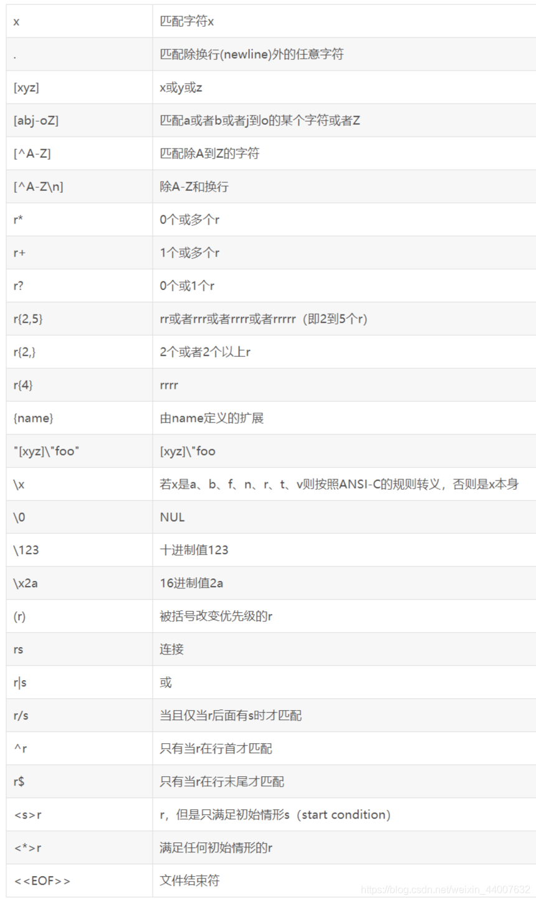
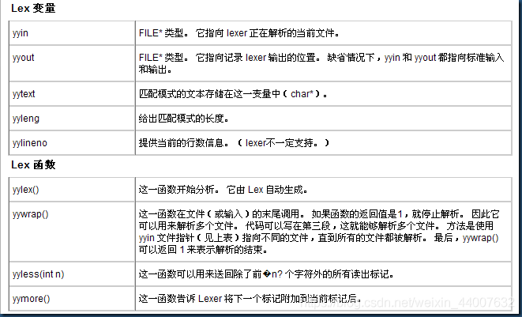

## [Flex学习文档](https://blog.csdn.net/weixin_44007632/article/details/108666375)

flex 的代码分为三个部分，由%%分割，这些部分可以为空，但为了让flex代码能够按照我们此前介绍的方法成功编译，需要加入部分内容形成下方的新手框架：

```c
%{

%}

%%

%%
int main(int argc, char **argv)
{
  yylex()
  return 0;
}
int yywrap()
{
	return 1;
}
```

①第一部分，较原框架加入了%{ %}，这对大括号内没有任何内容，所以目前起不到任何作用。加入这对大括号的目的是，在这个部分可以使用C语言代码进行预处理，例如使用#include<stdio.h>，或是定义宏、常量等等。

②第二部分，没有变化，这里的要写入的代码是重点内容，将在后续展开。

③第三部分，这个部分就是用来写C语言代码的，因此不需要使用%{%}括号对。在这里，我们添加了两个函数（从代码上来看这里似乎有三个函数？），接下来我们展开讲述这些内容。yylex()函数，其实会由第二部分我们写入的匹配规则自动生成，也就是说，**yylex()其实就是由lex产生的词法分析程序**，当我们调用它时，才会正式开始词法分析。关于这个函数的具体内容（后面）

④最后就是yywarp函数，这是一个约束函数，当它返回1时，代表扫描结束，此时结束程序。这个函数在读取多个文件时很有用处，关于它的进阶运用也会在未来而不是现在展开。

综上所述，我们讲述了flex代码的基本结构，并给出了一个新手框架。接下来，我们 **只要在第二部分中加入内容** ，在其他部分稍作修改，就能制作出一个有不错功能的带词法分析功能的程序了。

综上所述，我们讲述了flex代码的基本结构，并给出了一个新手框架。接下来，我们 **只要在第二部分中加入内容** ，在其他部分稍作修改，就能制作出一个有不错功能的带词法分析功能的程序了。

###### 第二部分的编写

第二部分由多条规则（rule）组成，每条rule可以由**pattern**与**action**组成。

> pattern使用正则表达式表示，含义为需要匹配的词的规则。
>
> action使用代码表示，含义为成功匹配该词后执行的动作。

以下是flex中的pattern参考：



示例代码：

```cpp
%{
int num=0;
int chars=0;
%}
%%
[a-zA-Z]+  { chars++; }
[1-9]+[0-9]* {num++;}
\n     
.      
%%
main(int argc, char **argv)
{
  yylex();
  printf("%8d%8d\n", num,chars);
}
int yywrap()
{
	return 1;
}

```

> Q1：对于规则③④，既然不做任何操作，那么为什么要匹配呢？
> A1：事实上，**flex对任何没有匹配到的字符，会自动做原样输出操作**。因此，对于那些不需要将其输出，而是需要将其忽略的pattern，应该进行匹配并做无操作处理。

> Q2：既然点号.可以匹配任意字符，显然也能匹配到规则①②的pattern，那么它们会起效吗？
> A2：flex拥有一套简单的消除歧义的规则，使词法分析程序工作的两条规则是：1、flex模式只匹配输入字符或字符串一次；2、flex执行当前输入的最长可能匹配的动作。第二条规则就解决了这个疑惑，显然，当匹配到任意一个字符时，它满足④的pattern，但flex会尽量向更长的pattern进行匹配，因此会继续向后读，直到后一个字符读入后将无法匹配任意一个pattern，此时才进行匹配。所以当满足数字或字母串（单词）的匹配规则时，它必然先匹配这两者。

> Q3：虽然这么说，但还是有一个问题――如果我只输入一个数字1，那么程序会把它判定为①的pattern还是④的pattern呢？
> A3：flex的规则有着隐藏优先级，即匹配长度相同时，将最上面的规则作为匹配结果。由于规则①在④的上面，所以显然会将其匹配成数字。

总结一下：flex匹配原则是1.最长匹配 2.匹配优先级根据写出的顺序 3.只匹配一次 4.未匹配的原样输出


**・检查关键字与标识符**

```cpp
输入：
double test(int a, double b)
{
  double c=(double) a;
  double d=b+c;
  if (d>0)
  return d;
  else
  return 0;
}

输出：
每行的输入都会形成相应的输出，请自行比对输出是否正确。
如对于第一行，会输出类似于以下的字符串：
KEY MARK KEY MARK KEY MARK

全部输入后，按两次Ctrl+C，结束输入，会类似于以下的输出：
MARK=10  KEY=10
数量正确即可

```

解答：

```cpp
%{
   int key=0;
   int mark=0;
%}

ALPHA [a-zA-Z]
MARK  {ALPHA}+[a-zA-Z0-9_]*
KEY   if|else|int|double|return

%%
{KEY}					printf("KEY ");key++;
{MARK}					printf("MARK "); mark++;
\n						printf("\n");
.

%%
int main(int argc, char **argv)
{
  yylex();
  printf("MARK=%d  KEY=%d",mark,key);
  yywrap();
}
int yywrap()
{
	return 1;
}

```

`定义的编写格式为：name definition`，definition其实就是第二部分要匹配的pattern。


**变量定义**

> 假设输入的文本是以下形式的合法字符串（因为我们还没有检测输入是否合法的能力）：
> int a=5;
> double b=2.2;
> [类型] [变量名] [=] [正实数]
> 则我们对于每行这样的输入，有以下输出：
> <[变量名],[类型],[值]>

```cpp
int a=5;			//input
<a,int,5>			//output
double b_def=2.33;	//input
<b_def,double,2.33>	//output 或为2.330000，只要值对就行

```




加餐】
到了这里，你对于lex/flex可以说是稍微入门了，但如果想再做点什么，特别是想要在深入学习后制作编程语言或是编译器，则这里还可以给你加点餐，增加对flex的理解。此外，flex本身不只是写词法分析器的工具，它事实上也是一个优秀的工具，仅靠flex也能写出不错的程序。
①使用yyout与yyin
现在我们想要在练习三的程序上做一点扩展，希望在运行时可以指定输入文件和输出文件，如下面所示：

a.exe  2.txt  3.txt
//从2.txt读数据，向3.txt写数据

```cpp
a.exe  2.txt  3.txt
//从2.txt读数据，向3.txt写数据
```

要如何对代码做改变呢？事实上，对main函数做一点改变即可：

```cpp
int main(int argc, char **argv)
{
  if (argc>1)
  {
    FILE *file;
	file=fopen(argv[1],"r");
	if(file)
	  yyin=file;
  }
  if (argc>2)
  {
	FILE *file;
	file=fopen(argv[2],"w");
	if(file)
	{
	  yyout=file;
	  //freopen(argv[2],"w",stdout);
	 }
  }
  
  yylex();
  yywrap();
}
```


## bison/yacc入门

```c
/*test.l*/
%{
#include <stdio.h>
#include "y.tab.h"
void yyerror(char *);
%}
NUM [1-9]+[0-9]*|0
%%

{NUM}		                return NUM;
"+"							return ADD;
"-"							return SUB;
"*"							return MUL;
"/"							return DIV;
[a-zA-Z_$]+[a-zA-Z_$0-9]*	return VAR;
\n                          return CR;
[ \t]+                     /* ignore whitespace */;
.
%%

```

①y.tab.h是bison在翻译代码时自动生成的头文件（这也是为什么我们先翻译.y文件），如果不加上这个头文件，则编译会出错。
②yyerror是bison代码中要用到的报错函数，既然是bison的报错函数，那么为什么不在bison中定义呢？事实上我们在两个代码中都定义了这个函数，这是因为程序不仅在语法分析阶段会报错，词法分析阶段也是会报错的。其实bison会自动定义这个函数，但我们想要使用自己编写的报错函数的话，则要重新声明它，否则会报警告。（我们希望尽量不被警告）


```c
/*test.y*/
%{
#include <stdio.h>
#include <string.h>
int yylex(void);
void yyerror(char *);
%}

%token NUM ADD SUB MUL DIV VAR CR

%%
       line_list: line
                | line_list line
                ;
			
	       line : expression CR  {printf("YES\n");}

      expression: term 
                | expression ADD term
				| expression SUB term
                ;

            term: single
				| term MUL single
				| term DIV single
				;
			
		  single: NUM
				| VAR
				;
%%
void yyerror(char *str){
    fprintf(stderr,"error:%s\n",str);
}

int yywrap(){
    return 1;
}
int main()
{
    yyparse();
}

```

下面来看bison的代码框架：

```cpp
定义(definations)
%%
规则(rules)
%%
代码(user code)
//=============================
%{
#include <stdio.h>
#include <string.h>
int yylex(void);
void yyerror(char *);
%}

%token NUM ADD SUB MUL DIV VAR CR

%%
```

我们定义了yylex()函数和yyerror()函数，它们都是我们此前已经讲过的函数，yylex就是flex中的词法分析函数。我们需要定义这两个函数，否则可能会报警告。

在%token后面，跟着一些字符串，我们就是在这里定义了这些符号，它们会被翻译成C头文件，被flex引用，然后又通过yylex()函数return回来。


接下来，我们看最关键的第二部分代码：

```cpp
line_list: line
                | line_list line
                ;

    line : expression CR  {printf("YES\n");}

    expression: term
                | expression ADD term
				| expression SUB term
                ;

    term: single
				| term MUL single
				| term DIV single
				;

    single: NUM
				| VAR
				;
%%
```

新手框架：

**flex**

```cpp
%{
#include "y.tab.h"
void yyerror(char *);
%}

%%

%%
```

**bison**

```cpp
%{
int yylex(void);
void yyerror(char *);
%}
%token 

%%

%%
void yyerror(char *str){
    fprintf(stderr,"error:%s\n",str);
}

int yywrap(){
    return 1;
}
int main()
{
    yyparse();
}

```
